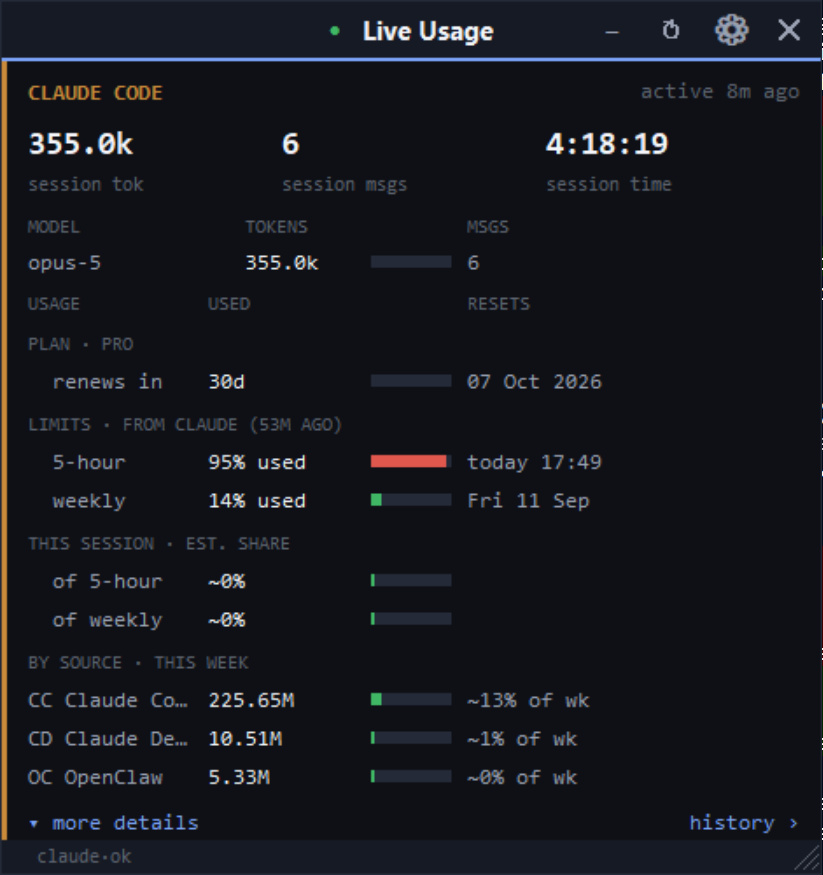
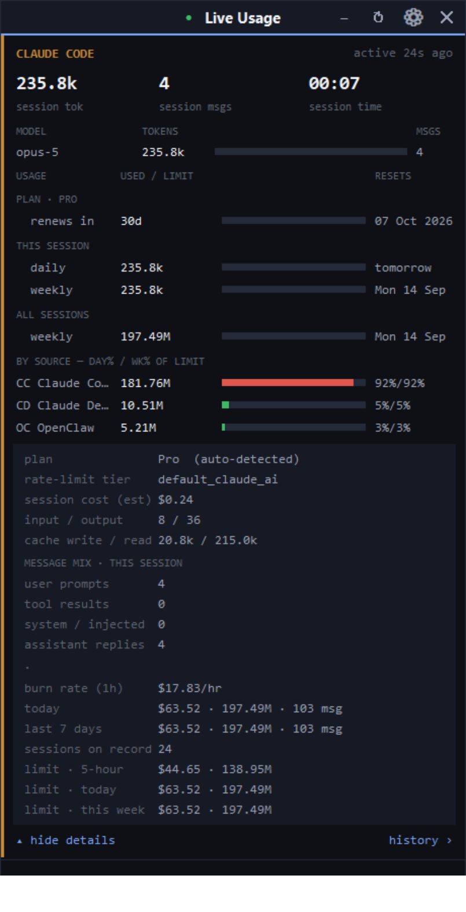

# Live Usage Widget — Claude Code + Antigravity + anything else

A small, frameless window you park next to your editor. Simple by default; the
detail is one click away.

> **Windows only.** The launchers (`.vbs` / `.bat`), the Antigravity detection
> (`language_server_windows_*.exe` + PowerShell), and the IDE / foreground /
> DPI handling all use Windows APIs (`ctypes.windll`, `powershell`, `tasklist`).
> The session-log parsing itself is portable, but the app as shipped does not
> run on macOS or Linux. Licensed **MIT** — see [`LICENSE`](LICENSE).

| Default view | ▾ more details | Minimized strip |
|---|---|---|
|  |  |  |

**Visibility.** By default it behaves like an IDE plugin: it is shown **only
while the Antigravity IDE window is focused**, slides out of the way when you
switch to another app, and **quits when you close the Antigravity IDE**. Switch
to plain always-on-top from the right-click menu → **Visibility → Always
visible** (or set `"visibility": "always"` in the config).

The **plan tier** (Pro / Max …) and **days left in the billing period** are
auto-detected from Claude Code's own login files — no configuration needed. The
`by source` rows attribute usage to every place Claude Code runs on the machine
(OpenClaw, Claude Desktop, plain Claude Code, …).

---

## What each agent shows

### Session agents — Claude Code, Codex, custom

The default view is deliberately minimal — **this session only**:

| Stat | Meaning |
|---|---|
| **tokens · this session** | every token *this session* used (input + output + cache) |
| **msgs · this session** | how many prompts **a human actually typed** this session — tool-result carriers, system reminders, slash-command echoes and hook output are classified out, not counted |
| **session time** | live clock since **the Antigravity IDE was launched** (read from the IDE process's own start time). It does *not* reset when Claude Code opens a new chat log, and it keeps counting even if the widget itself is restarted — it only returns to `0:00` when the **IDE** is restarted. In `always` visibility mode with no IDE running it falls back to the widget's own start time. |

Every stat in the top strip is scoped to the **current session**. Cumulative
figures live in the **usage** table below and under **▾ more details**.

Then two small tables:

- **models** — each model you used this session · its tokens · its message count.
- **usage** —
  - **plan · <tier>** · *renews in Nd* — the plan tier (Pro / Max …), days left
    in the billing period and the renewal date. **Auto-detected** from Claude
    Code's own login files (`~/.claude/.credentials.json`, `~/.claude.json`) —
    no config needed. Only the plan tier, account label and subscription dates
    are read; tokens/secrets never are. Override with a `subscription` block if
    the guessed date is wrong. Shows *trial ends in Nd* instead while a Claude
    Code trial is active. Plan tier, rate-limit tier and account also appear
    under **▾ more details**.
  - **limits · live** — the **real** rolling windows Anthropic enforces: the
    **5-hour** (session) window and the **weekly** (7-day) window, each with its
    true **% used** and true **reset time** — no estimate, no config. The widget
    calls the same endpoint `/usage` does (`api.anthropic.com/api/oauth/usage`,
    with Claude Code's stored OAuth token) on a ~90 s cache, so the bar updates
    on its own — you never have to type `/usage`. If that call is disabled
    (`"live_usage": false`) or fails, it falls back to Claude Code's on-disk
    cache (`~/.claude.json` → `cachedUsageUtilization`, only as fresh as the
    last time *you* ran `/usage`); the header then reads **"Claude cache
    (…ago)"**. Anthropic has no "daily" limit.
  - **this session · est. share** — roughly how much of each real window *this
    session* is responsible for, derived from Anthropic's live % over the same
    span (marked `~`).
  - **by source · this week** — one row per place Claude Code runs on this PC
    (each `~/.claude/projects/<folder>` folds into a named source — e.g.
    **OpenClaw**, **Claude Desktop**, plain **Claude Code**), with its tokens
    this week and its contribution to the weekly limit. Those contributions sum
    to the real weekly `% used`.

- **▾ more details** — session cost (est.), input/output split, cache write/read,
  a **message-mix** breakdown (user prompts · tool results · system/injected ·
  assistant replies) so you can see what the traffic was actually made of,
  burn rate ($/hr, last hour), today's total, last-7-days total, session count,
  plus the auto-detected plan / rate-limit tier / account.
  For Codex, the 5-hour and weekly rate-limit % come straight from its own logs.
- **history ›** — a window listing **every past session** with the same columns
  (when · duration · msgs · tokens · cost · models).

Token / message / cost data comes from the agent's own **local logs**
(`~/.claude/projects/**/*.jsonl`, `~/.codex/sessions/**/*.jsonl`, …) and never
leaves your machine. The one exception is the Claude **limit %** — the widget
calls Anthropic's `/api/oauth/usage` (same request `/usage` makes, same host,
your own OAuth token) so the bar stays current on its own. Turn that off with
`"live_usage": false` and it uses Claude Code's on-disk cache instead.

### Quota agents — Antigravity, OpenRouter

These don't have "sessions" — they have per-model allowances that refill on a
cycle, so the view is a table:

| Column | Meaning |
|---|---|
| **model** | the model name |
| **used / left** | % of that model's quota consumed / remaining |
| bar | green → amber → red as it drains; red = exhausted |
| **resets in** | the calendar date the quota recycles, e.g. `Mon, 14 Sep 2026` |

Top stats: models available · models exhausted · time to next reset.
**▾ more details** shows plan tier, prompt/flow-credit balances, account.

Antigravity data is read from the IDE's local Language Server (the private
Connect RPC the "Antigravity Token Usage" extension uses — found by scanning for
`language_server_windows_*.exe` and its CSRF token; auto-rediscovers when the IDE
restarts). Outbound calls: Claude's `/usage` endpoint (above; off with
`"live_usage": false`), and OpenRouter (off until you add a key). Nothing else.

---

## Controls

| Action | How |
|---|---|
| Move | drag anywhere on the body |
| **Resize** | drag the striped corner grip, **or** right-click → **Size** (Compact / Small / Medium / Large / Tall / Cycle) |
| **Minimize** | `‒` in the title bar, or double-click the title bar — collapses the window to just its title strip so you can park it out of the way; click `□` (same spot) or double-click again to restore |
| **Minimized-strip width** | while collapsed, drag the `⇔` grip on the strip's left edge, **or** right-click → **Minimized width** (Tiny / Short / Medium / Match window). Persists. |
| **Find the minimized strip** | hover it for ~2 s — the accent line shimmers through colours until you move away |
| Scroll | mouse-wheel |
| Opacity | `Ctrl` + mouse-wheel, or right-click → Opacity |
| Refresh now | `↻` in the title bar (all title-bar buttons are the same size / weight) |
| Open config | `⚙` in the title bar |
| Visibility mode | right-click → Visibility |
| More details | `▾ more details` under each section (remembered per agent) |
| History | `history ›` under each session agent |
| Close | `✕` |

Every title-bar button is the same size/weight and shows a tooltip on hover.
Window size, position, opacity, visibility mode, collapsed state + minimized
width, and which sections are expanded persist to `~/.claude-usage-widget.json`.

---

## Run it

**Silent:** double-click **`run-widget.vbs`**
**Or:** `run-widget.bat` · **Or:** `pythonw usage_widget.pyw`

Python 3.11+ with Tkinter (stock python.org build). No `pip install`.
**Start with Windows:** `Win+R` → `shell:startup` → shortcut to `run-widget.vbs`.

---

## Config — `~/.claude-usage-widget.json`

`providers` controls what appears. Each built-in auto-activates when its data is
present; set `"enabled": false` to hide one, `"enabled": true` to force it.

```jsonc
"visibility": "antigravity",      // or "always"
"live_usage": true,               // false = never call /usage; use disk cache
"providers": {
  "claude_code": {
    "enabled": true, "poll_seconds": 5,
    // The 5-hour + weekly limits, their % and reset times are read live from
    // Claude Code's own /usage cache - no ceilings to fill in. "limits" below
    // is only a fallback used if that cache is missing.
    "limits": {
      "five_hour": { "cost_usd": null, "tokens": null },
      "weekly":    { "cost_usd": null, "tokens": null }
    },
    "sources": {                  // optional: rename ~/.claude/projects folders
      "openclaw":  { "name": "OpenClaw", "badge": "OC", "color": "#d97706" }
    },
    "subscription": {             // optional — auto-detected from Claude's login
      "renews": "2026-10-01"      //   files; set this only to correct the date.
      // "renews_day": 1          //   day-of-month the plan renews on (1-31;
      //                          //   a day past the month's end lands on its
      //                          //   last day). A bad value just hides the row.
    }
  },
  "antigravity": { "enabled": true,  "poll_seconds": 30 },
  "codex":       { "poll_seconds": 10 },          // auto once ~/.codex/sessions exists
  "openrouter":  { "enabled": false, "api_key": "" },
  "custom": [
    {
      "enabled": true,
      "key": "myagent", "label": "My Agent", "color": "#cc7722",
      "glob": "~/.myagent/logs/*.jsonl",
      "ts_field": "timestamp", "model_field": "model", "role_field": "role",
      "input_field": "usage.input_tokens", "output_field": "usage.output_tokens",
      "cache_read_field": ""
    }
  ]
},
"pricing": {                        // optional: fix / add model prices ($/1M)
  "claude-sonnet-5": [3.0, 15.0]    // [input, output]; prefix-matched
}
```

A **custom** provider treats each matching `.jsonl` file as one session, counts
records where `role_field == "user"` as messages, and sums the token fields
(dotted paths allowed). It then gets the same simple view, "more details" and
"history" as Claude Code.

Cost figures are **estimates** — exact token counts, priced by the `PRICING`
table at the top of `usage_sources.py` (Claude + OpenAI models; cache-read 0.1×,
cache-write 1.25×). Unknown models are counted but priced at $0. Prices drift, so
override or add entries from the config without touching code:

```jsonc
"pricing": {
  "claude-sonnet-5": [3.0, 15.0],   // [input, output] USD per 1M tokens
  "my-model":        [1.0, 4.0]      // prefix-matched against the model id
}
```

---

## Files

| File | Purpose |
|---|---|
| `usage_widget.pyw` | window: layout, rendering, drag/resize/scroll, tooltips, history window |
| `usage_sources.py` | providers — one class per agent, all returning the same snapshot shape |
| `run-widget.vbs` / `.bat` | launchers |
| `test_pricing.py` | tests for the pricing table, config overrides, cost maths |
| `~/.claude-usage-widget.json` | saved window state + provider config |

---

## Tests

```sh
python -m unittest discover -v
```

Stdlib `unittest`, no `pip install` - same promise as the widget itself.
Covers the `PRICING` defaults, config overrides (including that one
config's overrides never leak into the next), `price_for()` longest-prefix
matching, and `cost_of()` maths.

---

## Troubleshooting

- **Antigravity: "not running"** — open the IDE; it's re-found automatically.
- **Antigravity: "data format changed"** — an IDE update changed the private
  RPC; the rest of the widget keeps working. Open an issue.
- **Codex section missing** — appears once Codex has written a session log to
  `~/.codex/sessions/`; force with `"enabled": true`.
- **Can't resize** — use the striped bottom-right grip, or right-click → Size.
- **Widget off-screen / wrong size** — delete `~/.claude-usage-widget.json`
  (back up your `providers` block first).
- **Wrong cost** — add a `pricing` block to the config (see above).
- **Limit % / reset looks stale** — the header shows how old Claude Code's
  cached `/usage` figures are; run `/usage` in Claude Code to refresh them.

---

## Limitations

- **Windows only** — see the note at the top.
- **Antigravity** integration reads the IDE's *private, undocumented* local RPC
  (the one the "Antigravity Token Usage" extension uses). An IDE update can
  change or remove it; the widget then shows an error for that section only and
  everything else keeps working.
- **Costs are estimates.** The `PRICING` table is a hand-maintained snapshot and
  goes out of date when providers change prices or ship models; unknown models
  price at $0. Correct it with the `pricing` config block.
- **Claude limit figures** come from `api.anthropic.com/api/oauth/usage` (the
  endpoint `/usage` uses), called with Claude Code's stored OAuth token on a
  ~90 s in-memory cache. The token is used only for that one request's
  `Authorization` header and is never logged. If the token is expired, the call
  is disabled (`"live_usage": false`), or the request fails, the widget falls
  back to Claude Code's on-disk cache — only as fresh as your last manual
  `/usage` — and the header says so. This is an undocumented OAuth endpoint and
  could change.
- Read-only otherwise: local files and the Antigravity localhost RPC. The only
  other outbound call is OpenRouter, and only if you add a key.

---

## License

[MIT](LICENSE) © Zeeshan Qadir. Use it, fork it, ship it.
